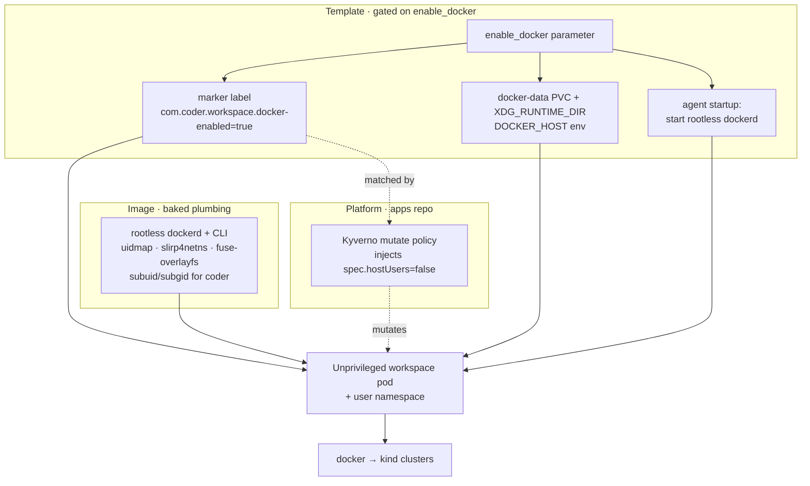

# DESIGN-DIND.md — nested containers in the workspace

Why the workspace can run Docker and `kind` while staying an unprivileged pod, and how the
pieces fit. This is a focused companion to [DESIGN.md](DESIGN.md); read that first for the
repo-wide intent and the image/template split.

## Intent

A lot of the work done in these workspaces is Kubernetes/GitOps: building container images and
standing up throwaway `kind` clusters (for example, to run another repo's `chainsaw` tests
locally, the same way CI does). That needs a container runtime *inside* the workspace.

The constraint that shapes everything: **the workspace must stay unprivileged**. No `privileged`
container, no `CAP_SYS_ADMIN`, no host Docker socket mounted in. The workspace runs as a fixed
non-root UID and should not be a foothold onto the node. So "just run Docker" is exactly what we
can't do — the whole design is about getting a usable container runtime *without* relaxing that.

## Options considered

The obvious answers all fail the unprivileged/low-blast-radius bar in different ways:

| Approach | Why not |
| --- | --- |
| Privileged Docker sidecar / mount the node's docker socket | Gives the workspace root on the node. Rejected outright. |
| **Sysbox** runtime | Solid isolation, but it's a **node-level** runtime install + `RuntimeClass` — a platform component with high blast radius, and its maintenance/OS-support story is shaky. |
| **Envbox** | Wraps Sysbox but requires a **privileged outer pod**. Rejects on the same privilege bar. |
| **Kata Containers** | Real VM isolation, but a node-level runtime + `RuntimeClass` dependency and needs KVM/nested-virt. High blast radius for a homelab. |
| **Rootless Docker/Podman inside the pod** | Runtime is **pod-local** — nothing installed on the node. This is the one that fits. |

Within the rootless family, **Docker** was chosen over Podman/nerdctl for one practical reason:
the consuming repo's CI runs `kind` on its **default Docker provider**, and matching that keeps
"what I run locally" identical to "what CI runs" — no experimental-provider divergence. The cost
is that rootless `dockerd` is the fiddliest of the three to bring up in a bare pod (no user
systemd session); accepted deliberately for the local-==-CI payoff.

### The strong-isolation piece: user namespaces

Rootless alone still benefits enormously from a **user namespace** that maps the workspace's
in-container root to an unprivileged host UID — that's what makes a container breakout land as
"nobody" on the node rather than something with reach. Kubernetes exposes this as
`pod.spec.hostUsers: false` (GA on the cluster we target).

The catch, and the reason this design has a moving part that looks odd: **the Terraform
`kubernetes` provider we're pinned to has no field to set `hostUsers`**. Rather than abandon the
typed `kubernetes_deployment_v1` resource (rewriting the whole pod as a raw manifest loses
validation and forces unrelated refactors), we set the field **out of band with a Kyverno mutate
policy** that lives with the platform, keyed off a marker label the template stamps only when the
user opts in. The template stays typed and simple; the platform grants the privilege-reducing
mapping. When the provider gains the field, the policy is deleted and the template sets it
directly — a one-line change, not a redesign.

## How the pieces compose

The division of labour: the **image** carries the universal, stable plumbing (baked so startup is
fast and reproducible — the [DESIGN.md](DESIGN.md#where-the-workspace-environment-comes-from)
layering rule); the **template** turns it on per-workspace and provides the pod-local storage and
runtime wiring; the **platform policy** supplies the one thing the template can't express. `kind`
itself is *not* baked into the image — it's day-to-day tooling and comes from the operator's
dotfiles (aqua), per the same layering rule.

## Trade-offs and things to know

- **Opt-in, not baseline.** The plumbing is baked into every image (it must be — the setuid
  `newuidmap`/`newgidmap` and subuid/subgid ranges can only be set at build time as root), but the
  *behaviour* (daemon start, the PVC, `hostUsers` mutation) is gated behind `enable_docker`. A
  workspace that doesn't opt in is byte-for-byte the same runtime posture as before.
- **Storage is a dedicated PVC, and survives stop/start.** Docker's image/layer store and `kind`
  node images are large and worth keeping between sessions, so they live on their own
  `ReadWriteOnce` block PVC rather than the shared home volume or an `emptyDir`. Crucially it is
  gated on `enable_docker` but **not** on `start_count`, mirroring the external home PVC — tying it
  to `start_count` would wipe every pulled image on each workspace *stop*.
- **Storage driver.** With a user namespace and a modern kernel, native `overlay2` works and needs
  no `/dev/fuse` (which the unprivileged pod lacks); `fuse-overlayfs` is the fallback, `vfs` the
  last resort. The daemon auto-detects.
- **Degrades, doesn't break.** If the Kyverno policy is absent or fails open, the pod still runs —
  just without the `hostUsers` mapping (weaker isolation). The marker label and the policy are a
  cross-repo contract; neither should be renamed in isolation.
- **No nested cgroup resource limits.** Rootless dockerd in a pod with no user systemd session
  runs without delegated cgroup limits; the workspace pod's own Kubernetes limits still cap
  everything, which is fine for a single operator.

## Future: migrating the cluster runtime

This design is deliberately runtime-agnostic and should *ease* a future migration to a different
Kubernetes distro rather than block it:

- The image and startup scripts are not tied to the current distro; they carry over unchanged.
- User namespaces (`hostUsers: false`) are a standard Kubernetes feature; the target distro
  already enables the necessary kubelet/runtime support, so the same mechanism applies.
- The Kyverno policy is platform-level and portable as-is.
- The one thing to re-check at migration time is that the docker-data PVC's storage class exists on
  the new cluster (or swap it for the equivalent).

The `hostUsers`-via-policy indirection is the only piece expected to be temporary: once the
Terraform provider exposes the field, the template sets it directly and the policy retires.
