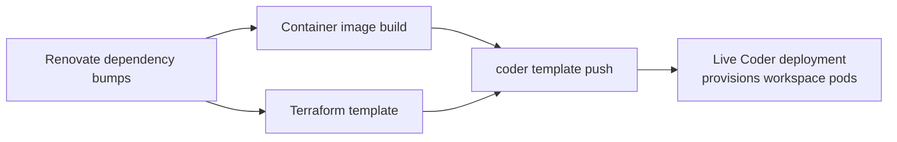

# DESIGN.md

Why this repo is shaped the way it is, and how its pieces tie together as one system. For what each piece is and where it lives, see [README.md](README.md). For commands and implementation gotchas, see [CLAUDE.md](CLAUDE.md).

## Intent

One operator, one homelab Kubernetes cluster, one Coder deployment. This is not a multi-tenant or general-purpose template — it's optimized for a single person keeping their own dev environments current with minimal ongoing effort, not for flexibility across teams or clusters.

## How the pieces tie together

The image and template are two halves of one release, not independent artifacts: a release build produces an image tag, and the *same* pipeline run pushes the template pointing at that exact tag. There's no version matrix of "which template versions work with which image versions" to reason about — the pipeline guarantees there's only ever one pairing in play. The cost is coupling: an image-only fix still needs a template push (and vice versa) to ship.

Renovate feeds both halves continuously (Terraform provider versions, image package/tool versions, GitHub Actions), so the day-to-day work in this repo is mostly reviewing and merging those bumps rather than writing new template/image logic.

## Design tensions and decisions

**Reproducible image vs. self-service packages.** A workspace user can request extra system packages via a template parameter rather than needing an image rebuild reviewed and released. That means the workspace's installed-package set isn't fully determined by the image alone — a deliberate trade of strict reproducibility for letting one-off tooling needs be self-served instead of turning into an image-change request every time.

**Shared persistence, not per-workspace isolation.** All workspaces provisioned from this template persist their home directory (and installed tools like Homebrew) onto one shared volume, isolated from each other only logically rather than through separate storage. For a single-operator homelab, this is simpler to provision and reason about than storage-per-workspace, at the cost of weaker isolation between workspaces than a multi-tenant design would want.

**No staging environment, so the release pipeline carries its own rehearsal path.** There's exactly one live template and one live cluster — no separate staging Coder deployment to try changes against first. Rather than accept "every merge to main is a live-fire test," the release pipeline itself can run in a mode that exercises a real build and a real (but disposable, clearly-named) template push without touching the production template or its persistent state. That path is what makes it safe to iterate on template/image changes at the same pace as everything else in the repo. See [TESTING.md](TESTING.md) for how to use it.

**Unprivileged by default.** The workspace itself runs as an unprivileged, non-root, fixed-identity container. Anything that genuinely needs elevated privilege (installing packages, preparing shared volume state) is scoped to a narrow, short-lived setup step that runs before the workspace shell exists, not to something the workspace user can reach into.

## Outcomes targeted

- One operator can keep dependencies current and ship template/image changes at low ongoing effort, without a fleet of environments to maintain.
- Changes can be exercised for real before they affect the template already in use — safe iteration without a staging cluster.
- Workspace users get self-service customization without being able to affect anything beyond their own workspace's package set and environment.
