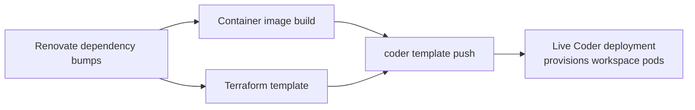
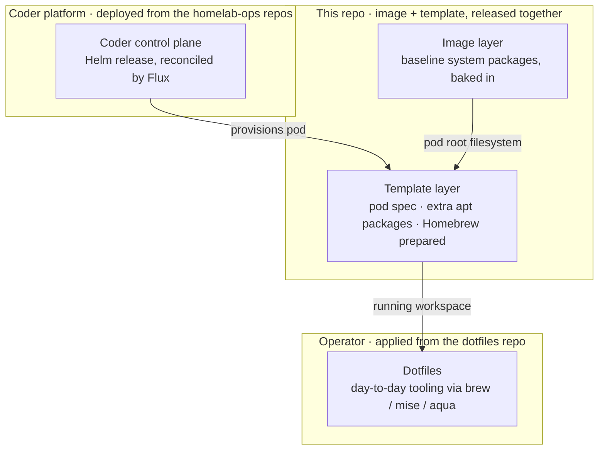

# DESIGN.md

Why this repo is shaped the way it is, and how its pieces tie together as one system. For what each piece is and where it lives, see [README.md](README.md). For commands and implementation gotchas, see [CLAUDE.md](CLAUDE.md).

## Intent

One operator, one homelab Kubernetes cluster, one Coder deployment. This is not a multi-tenant or general-purpose template — it's optimized for a single person keeping their own dev environments current with minimal ongoing effort, not for flexibility across teams or clusters.

## How the pieces tie together

The image and template are two halves of one release, not independent artifacts: a release build produces an image tag, and the *same* pipeline run pushes the template pointing at that exact tag. There's no version matrix of "which template versions work with which image versions" to reason about — the pipeline guarantees there's only ever one pairing in play. The cost is coupling: an image-only fix still needs a template push (and vice versa) to ship.

The "live Coder deployment" this pushes to is itself provisioned separately, and what an operator actually works in is assembled from more layers than these two — see [Where the workspace environment comes from](#where-the-workspace-environment-comes-from) below.

Renovate feeds both halves continuously (Terraform provider versions, image package/tool versions, GitHub Actions), so the day-to-day work in this repo is mostly reviewing and merging those bumps rather than writing new template/image logic.

## Where the workspace environment comes from

The environment an operator ends up working in isn't defined in one place — it's assembled in layers, and this repo owns only the middle two. Each layer downward is more shared, more reproducible, and changed less often; each layer upward is more personal and more self-service.

- **Coder platform** — the control plane that runs these templates is itself deployed to the cluster elsewhere: the Helm release in [`homelab-ops-kubernetes-apps`](../homelab-ops-kubernetes-apps/apps/subsystems/coder/helm-release-coder.yaml) and the Flux Kustomization that wires it into the homelab cluster in [`homelab-ops-kubernetes-clusters`](../homelab-ops-kubernetes-clusters/clusters/homelab/kustomizations/apps-coder.yaml). This repo produces what runs *on* that platform, not the platform itself.
- **Image** ([`Dockerfile`](images/homelab-workspace/Dockerfile)) — the baseline every workspace needs and nothing more. Baked in so startup is fast and the result reproducible; the cost of a rebuild-and-release is only worth paying for things wanted everywhere.
- **Template** ([`deployment.tf`](templates/kubernetes/homelab-workspace/deployment.tf), [`script-prepare-workspace.sh`](templates/kubernetes/homelab-workspace/script-prepare-workspace.sh)) — builds the pod and closes the gap between the baseline image and a usable workspace: a small set of extra apt packages (build toolchains and the like — left out of the image because they're large and only occasionally needed, yet only sensibly obtained as apt packages) and Homebrew installed and prepared so the layer above has something to build on.
- **Dotfiles** ([`dotfiles`](../dotfiles)) — at provision time the operator's dotfiles configure the shell/environment and install the actual day-to-day tooling via Homebrew, mise, and aqua. This is per-operator and changes constantly, so it lives with the operator rather than in the template.

The rule that ties the layers together: a package or tool belongs in the *lowest* layer that still makes sense for it. Universal and stable → image. Occasionally-needed, apt-only, and too heavy to bake in → the template's `system_packages` parameter. Personal, fast-moving, or not an apt package → dotfiles. This is what keeps the image small and reproducible while still letting one-off needs be self-served — the same trade examined from the package angle in [Reproducible image vs. self-service packages](#design-tensions-and-decisions) below.

## Design tensions and decisions

**Reproducible image vs. self-service packages.** A workspace user can request extra system packages via a template parameter rather than needing an image rebuild reviewed and released. That means the workspace's installed-package set isn't fully determined by the image alone — a deliberate trade of strict reproducibility for letting one-off tooling needs be self-served instead of turning into an image-change request every time.

**Shared persistence, not per-workspace isolation.** All workspaces provisioned from this template persist their home directory (and installed tools like Homebrew) onto one shared volume, isolated from each other only logically rather than through separate storage. For a single-operator homelab, this is simpler to provision and reason about than storage-per-workspace, at the cost of weaker isolation between workspaces than a multi-tenant design would want.

**No staging environment, so the release pipeline carries its own rehearsal path.** There's exactly one live template and one live cluster — no separate staging Coder deployment to try changes against first. Rather than accept "every merge to main is a live-fire test," the release pipeline itself can run in a mode that exercises a real build and a real (but disposable, clearly-named) template push without touching the production template or its persistent state. That path is what makes it safe to iterate on template/image changes at the same pace as everything else in the repo. See [TESTING.md](TESTING.md) for how to use it.

**Unprivileged by default.** The workspace itself runs as an unprivileged, non-root, fixed-identity container. Anything that genuinely needs elevated privilege (installing packages, preparing shared volume state) is scoped to a narrow, short-lived setup step that runs before the workspace shell exists, not to something the workspace user can reach into.

**Nested containers without giving up that posture.** Running Docker and `kind` *inside* the workspace would normally mean a privileged pod or a node-level runtime — both rejected here. Instead an opt-in rootless-Docker setup keeps the pod unprivileged and socket-free, with user-namespace isolation supplied by a platform Kyverno policy. This is a large enough topic to have its own design doc — see [DESIGN-DIND.md](DESIGN-DIND.md), which also covers the cluster-runtime migration angle.

## Outcomes targeted

- One operator can keep dependencies current and ship template/image changes at low ongoing effort, without a fleet of environments to maintain.
- Changes can be exercised for real before they affect the template already in use — safe iteration without a staging cluster.
- Workspace users get self-service customization without being able to affect anything beyond their own workspace's package set and environment.
