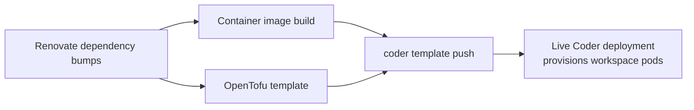
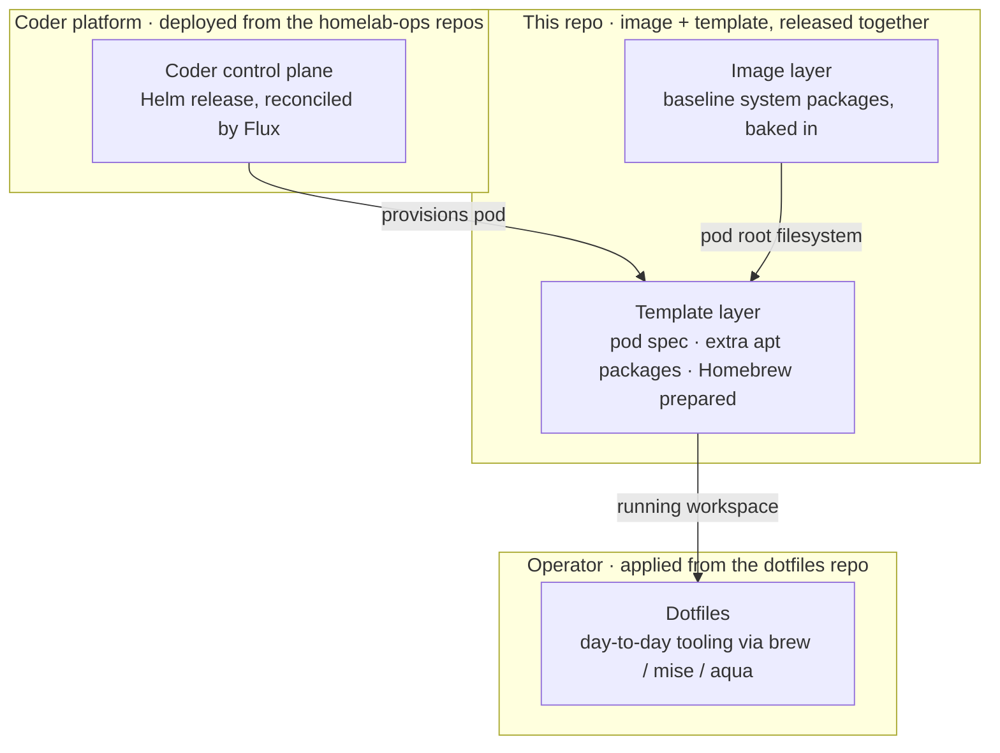

# DESIGN.md

Why this repo is shaped the way it is, and how its pieces tie together as one system. For what each piece is and where it lives, see [README.md](README.md). For commands and implementation gotchas, see [CLAUDE.md](CLAUDE.md).

## Intent

One operator, one homelab Kubernetes cluster, one Coder deployment. This is not a multi-tenant or general-purpose template — it's optimized for a single person keeping their own dev environments current with minimal ongoing effort, not for flexibility across teams or clusters.

## How the pieces tie together


```mermaid
flowchart LR
    Renovate[Renovate dependency bumps] --> Image
    Renovate --> Template

    Image[Container image build] --> Push[coder template push]
    Template[OpenTofu template] --> Push
    Push --> Live[Live Coder deployment<br/>provisions workspace pods]
```

The image and template are two halves of one release, not independent artifacts: a release build produces an image tag, and the *same* pipeline run pushes the template pointing at that exact tag. There's no version matrix of "which template versions work with which image versions" to reason about — the pipeline guarantees there's only ever one pairing in play. The cost is coupling: an image-only fix still needs a template push (and vice versa) to ship.

The "live Coder deployment" this pushes to is itself provisioned separately, and what an operator actually works in is assembled from more layers than these two — see [Where the workspace environment comes from](#where-the-workspace-environment-comes-from) below.

Renovate feeds both halves continuously (OpenTofu provider versions, image package/tool versions, GitHub Actions), so the day-to-day work in this repo is mostly reviewing and merging those bumps rather than writing new template/image logic.

## Where the workspace environment comes from

The environment an operator ends up working in isn't defined in one place — it's assembled in layers, and this repo owns only the middle two. Each layer downward is more shared, more reproducible, and changed less often; each layer upward is more personal and more self-service.


```mermaid
flowchart TB
    subgraph platform [Coder platform · deployed from the homelab-ops repos]
      Coder[Coder control plane<br/>Helm release, reconciled by Flux]
    end
    subgraph here [This repo · image + template, released together]
      Image[Image layer<br/>baseline system packages, baked in]
      Template[Template layer<br/>pod spec · extra apt packages · Homebrew prepared]
    end
    subgraph operator [Operator · applied from the dotfiles repo]
      Dotfiles[Dotfiles<br/>day-to-day tooling via brew / mise / aqua]
    end

    Coder -->|provisions pod| Template
    Image -->|pod root filesystem| Template
    Template -->|running workspace| Dotfiles
```

- **Coder platform** — the control plane that runs these templates is itself deployed to the cluster elsewhere: the Helm release in [`homelab-ops-kubernetes-apps`](../homelab-ops-kubernetes-apps/apps/subsystems/coder/helm-release-coder.yaml) and the Flux Kustomization that wires it into the homelab cluster in [`homelab-ops-kubernetes-clusters`](../homelab-ops-kubernetes-clusters/clusters/homelab/kustomizations/apps-coder.yaml). This repo produces what runs *on* that platform, not the platform itself.
- **Image** ([`Dockerfile`](images/homelab-workspace/Dockerfile)) — the baseline every workspace needs and nothing more. Baked in so startup is fast and the result reproducible; the cost of a rebuild-and-release is only worth paying for things wanted everywhere.
- **Template** ([`deployment.tf`](templates/kubernetes/homelab-workspace/deployment.tf), [`script-prepare-workspace.sh`](templates/kubernetes/homelab-workspace/script-prepare-workspace.sh)) — builds the pod and closes the gap between the baseline image and a usable workspace: a small set of extra apt packages (build toolchains and the like — left out of the image because they're large and only occasionally needed, yet only sensibly obtained as apt packages) and Homebrew installed and prepared so the layer above has something to build on.
- **Dotfiles** ([`dotfiles`](../dotfiles)) — at provision time the operator's dotfiles configure the shell/environment and install the actual day-to-day tooling via Homebrew, mise, and aqua. This is per-operator and changes constantly, so it lives with the operator rather than in the template.

The rule that ties the layers together: a package or tool belongs in the *lowest* layer that still makes sense for it. Universal and stable → image. Occasionally-needed, apt-only, and too heavy to bake in → the template's `system_packages` parameter. Personal, fast-moving, or not an apt package → dotfiles. This is what keeps the image small and reproducible while still letting one-off needs be self-served — the same trade examined from the package angle in [Reproducible image vs. self-service packages](#design-tensions-and-decisions) below.

## Design tensions and decisions

**Reproducible image vs. self-service packages.** A workspace user can request extra system packages via a template parameter rather than needing an image rebuild reviewed and released. That means the workspace's installed-package set isn't fully determined by the image alone — a deliberate trade of strict reproducibility for letting one-off tooling needs be self-served instead of turning into an image-change request every time.

**Shared persistence, not per-workspace isolation.** All workspaces provisioned from this template persist their home directory (and installed tools like Homebrew) onto one shared volume, isolated from each other only logically rather than through separate storage. For a single-operator homelab, this is simpler to provision and reason about than storage-per-workspace, at the cost of weaker isolation between workspaces than a multi-tenant design would want.

**No staging environment, so the release pipeline carries its own rehearsal path.** There's exactly one live template and one live cluster — no separate staging Coder deployment to try changes against first. Rather than accept "every merge to main is a live-fire test," the release pipeline itself can run in a mode that exercises a real build and a real (but disposable, clearly-named) template push without touching the production template or its persistent state. That path is what makes it safe to iterate on template/image changes at the same pace as everything else in the repo. See [TESTING.md](TESTING.md) for how to use it.

**The template is authored in OpenTofu; the live deployment's provisioner is a separate repo's decision, not this one's.** Coder has no concept of a provisioning tool beyond "whatever binary is named `terraform` on `PATH`, in a supported numeric version range" — there is no vendor check, so a `tofu` binary standing in for that name applies the template identically. This repo can only control the provisioner in its own disposable test control plane (`.github/compose/compose.yaml`), which bind-mounts an OpenTofu binary over the official Coder image's own `terraform` path — both to dogfood the toolchain this repo now authors in, and because that swap is what surfaces a real Terraform/OpenTofu behavioral divergence, if this template's HCL ever grows one, before it reaches a real deployment. The live deployment's provisioner is owned by `homelab-ops-kubernetes-apps` — `homelab-ops-kubernetes-apps#3900` makes the same swap there, via a Kubernetes-native init-container-plus-`emptyDir` mechanism instead of a Docker bind mount — that cluster's containerd doesn't support single-file subPath mounts on image volumes, only whole-directory.

**`/tmp` is node-local scratch space, deliberately not the shared home volume.** Every workspace's `/tmp` used to be whatever the container's writable overlay layer gave it for free - fast, but unbounded, and on the node's root filesystem. On the operator's own long-lived workspace that grew to several GiB (dominated by Claude Code's own scratch directory, `$TMPDIR/claude-<uid>/...`, which agent sessions use for downloads and experiments) and pushed the node toward the kubelet's disk-pressure eviction threshold - a risk to every other pod on that node, not just the workspace that caused it. The home PVC has ample free space, but is NFS-backed, which is a bad fit for what actually lives in `/tmp`: build caches and compiler intermediates are exactly the write-heavy, latency-sensitive workload NFS handles worst. A plain `empty_dir` would keep `/tmp` fast but doesn't fix anything, because `empty_dir` lives on the same constrained node root filesystem the container overlay already did. The fix is a Kubernetes "generic ephemeral volume" on a Longhorn storage class that is both node-local (so still fast) and backed by a separate, much larger partition on the same node than the root filesystem is - see the comment on the `tmp` volume in `deployment.tf` for the specific class and why it's the non-replicated one (scratch data costs nothing to lose) rather than the default replicated class other PVCs in this cluster use. Its size is a fixed ceiling rather than left unbounded, so a runaway consumer now fails predictably inside its own volume instead of eventually pressuring the node. Because this volume's lifecycle is tied to the Pod rather than the container, something has to wipe it on every container start, so a container restart within a live Pod doesn't just inherit whatever the previous container left behind.

**That wipe runs in the container entrypoint because `/tmp` is not only scratch space - the Coder agent lives there too.** The first attempt put the wipe in `script-agent-startup.sh`, which is the wrong side of the ordering and shipped a broken template: Coder's generated bootstrap downloads the agent CLI into a per-boot `mktemp -d -t coder.XXXXXX` directory under `/tmp`, makes it the agent's working directory, appends it to the PATH of every session and script the agent runs, and *then* runs the startup script - which deleted it, leaving every `coder stat` metadata panel reporting `coder: command not found` while the agent process itself carried on from an unlinked binary. The tempting repair is to exclude the agent's own paths from the wipe, and it is the wrong one: that set is an implementation detail of whatever agent version the control plane happens to serve, and it is not even uniformly named - v2.35.3 owns a random-suffixed `coder.XXXXXX/`, `coder-agent.sock` (a hardcoded absolute path, not a `TMPDIR`-relative one), rotated `coder-agent*.log` files, `coder-script-data/`, `coder-screen/`, and `boundary-audit.sock`, which carries no `coder` prefix at all. An allowlist would stop matching on some future upgrade and fail exactly as invisibly as the original bug. The workspace container's `command` is therefore a small entrypoint script that wipes `/tmp` and `exec`s Coder's bootstrap: it is the only hook that runs on a container-only restart within a live Pod (init containers run once per Pod), it runs before the agent exists so there is nothing to exclude, and `exec` keeps the agent as PID 1 for orphan reaping and the liveness probe. The wipe there is best-effort rather than fatal, because that entrypoint is the only path to a running agent and a hard failure would be a `CrashLoopBackOff` nobody can shell into; it records its outcome instead, and `script-agent-startup.sh` asserts both that outcome and that the agent CLI still resolves and runs - the check the original change lacked, which turns a recurrence into a failed startup script in the workspace UI instead of eight quietly broken metadata panels.

**Unprivileged by default.** The workspace itself runs as an unprivileged, non-root, fixed-identity container. Anything that genuinely needs elevated privilege (installing packages, preparing shared volume state) is scoped to a narrow, short-lived setup step that runs before the workspace shell exists, not to something the workspace user can reach into.

**The Deployment name is a Prometheus identity, not just a Kubernetes identifier.** `deployment.tf` names the workspace Deployment `coder-workspace-<owner>-<workspace-name>` (`local.workload_name` in `main.tf`) rather than the workspace UUID it used before. cAdvisor's `container_*` series carry no Kubernetes labels — they come from the cgroup filesystem, with no API-server connection — so per-workspace CPU/memory/PSI/OOM can only be attributed to a human-readable identity through the cluster's existing `namespace_workload_pod:kube_pod_owner:relabel` recording rule, which resolves pod → ReplicaSet → Deployment into a `workload` label. That rule already runs for free; naming the Deployment meaningfully is the only lever this repo has to make its output meaningful, at zero added Prometheus series and no PromQL join. Three things shape the exact scheme:

- *Owner is included* even though this is a single-operator homelab today, because Coder workspace names are unique per-owner, not cluster-wide — two owners could otherwise pick the same workspace name and collide. Cheap to include now; expensive to retrofit after a second migration.
- *The prefix is `coder-workspace-`, not just `coder-`*, matching the `app.kubernetes.io/part-of` value already used in `main.tf`'s `common_labels`. A bare `coder-` prefix isn't enough to unambiguously mean "workspace": the same Kubernetes namespace also holds the `coder` control-plane Deployment itself and other `coder`-prefixed infra (e.g. a CloudNativePG cluster named `coder-db-<date>`) that a naive `workload=~"coder-.+"` match would also catch.
- *Renaming a workspace already relocates its home directory* (the `home` volume's `sub_path` is `data.coder_workspace.me.name`), so coupling the Deployment name to the workspace name too doesn't introduce a new class of rename hazard — it's already priced in. A rename recreates the Deployment (the pod restarts anyway) and needs a fresh `coder-workspace-<owner>-<new-name>` home subdirectory, exactly as it needed a fresh `sub_path` before this change.

**A userspace memory watchdog that bounds the standing population of helper processes.** The workspace pod has a hard memory limit and no way to enforce anything below it: `/sys/fs/cgroup` is mounted read-only, `cgroup.subtree_control` is empty, the cgroup namespace is private and the workspace user has no capabilities, so `memory.high` and a child cgroup both need `privileged: true` or a read-write host mount — exactly what *Unprivileged by default* above exists to prevent. Until recently `memory.oom.group` was `1`, so a cgroup OOM killed every process in the container together and `oom_score_adj` could not influence a victim selection that no longer happened. The kubelet now sets `singleProcessOOMKill`, so a container created since that change gets `memory.oom.group = 0` and an OOM kills only the offending process — verified from inside a pod created after the rollout, while a container predating it still reads `1` because the value is fixed when the container is created. That setting lives on the nodes and in no repository (`ppat/homelab-ops-kubernetes-clusters#948`), so it is a property of node state rather than a guarantee this template can rely on.

[`script-memory-watchdog.sh`](templates/kubernetes/homelab-workspace/script-memory-watchdog.sh) does **not** try to prevent that OOM, and the earlier version of this section, which said it did, was wrong on the evidence. The recorded kills are spikes: 70–220 MB/s, idle to dead inside a minute, with an agent session or `node` named as the victim in the kernel log and never a VS Code process. A poll loop cannot win that race — a generic biggest-RSS killer beats the kernel only at a 0.3 s interval, loses at 0.5 s, and under the `oom.group = 1` that then applied was killed by the very event it lost. The graded shedding ladder that used to live here was exercised against a real spike, climbed correctly, and logged `no-candidates`: the runaway was not in the tree it managed, and the whole editor tree it *could* have shed is ~0.7 GiB, or five seconds of that growth rate. The ladder has been removed rather than tuned, and the measurement it did well — unreclaimable memory, pressure, refault and reclaim rates — has been kept.

What a poll loop is good at is growth measured in MB per *minute*, and that drift is the real, daily problem: the operator was policing it by hand for months, repeatedly killing VS Code to save agent sessions, with a python MCP server holding 1.66 GB at one of the kills. So the watchdog now keeps the resting population of **restartable helpers** inside per-role budgets. The goal is runway rather than rescue: when a spike does arrive, it starts from as much free memory as the pod can offer. Every process it may signal has a supervisor — VS Code respawns its own forks and language servers, an agent session respawns its MCP servers — so a wrong kill costs a reload, not a session, and that asymmetry is what licenses being aggressive.

That licence has a limit, and the limit is *calibration* rather than blast radius. Selection used to return `other` for any process in the server tree that no pattern named, and the policed set skipped `other` — so three genuine helpers, one of them holding 280 MB PSS, had no budget, no dwell clock and no warning attached to them. Widening the pattern list per extension is the easy answer and the wrong one: the launch shapes belong to the extensions, so the list is a permanent race that fails silently, one extension at a time. The default inside the tree is therefore inverted — unknown means governed — and the risk that creates is paid for explicitly rather than assumed away. An unnamed in-tree process gets the `treeHelper` role: measured, budgeted, dwell-tracked and reported in every mode, and armed like every other role. It used to be armed only under `enforce-all`, because its budget was a reasoned guess and this design has twice shipped a limit that sat below what a healthy process already held; what pays for that risk now is the oversize rule below rather than an arming exception, which is a better instrument because it acts on the process actually running instead of on a class. Separately, a direct child of a server root is excluded from the role outright: VS Code's core forks are exactly those direct children, so a future release that renames `--type=extensionHost` produces a process that is unmanaged and conspicuous rather than one carrying a helper's share against the several times more it actually holds.

**The VS Code tree is given one 2048 MiB envelope, and every other number here is a share of it.** In one sentence: each role holds a named share that does not vary with pod size, and a process is killed when its PSS has been above its share for ten continuous minutes *and* it has been observed inside that share at some point since it started. The shares are `serverMain` 512 MiB, `extensionHost` 480, `tsserver` 320, `treeHelper` 320, `fileWatcher` 160, `languageServer` 128, `extensionHelper` 128 — 2048 exactly — with `claudeHelper` at 512 MiB deliberately outside the envelope, because an MCP server is not VS Code and its number is anchored on a measured *adversary* (the 1.66 GB python server this mechanism was built for) rather than on a share of anything. The largest share goes to `serverMain` by *consequence* rather than by size: it holds the remote connection, so a wrong kill costs a disconnect rather than a reload, and it should be the share least likely to be reached by accident. That the biggest share therefore goes to the role with the smallest measured appetite — 233 MB over 38 hours — is a real cost of roughly 280 MiB, paid on purpose. PSS is the quantity compared, not RSS and not `VmData`: `VmData` was only ever relevant because `RLIMIT_DATA` accounts it, and on a V8 process it runs an order of magnitude above what the pod actually pays.

What this replaced was `max(min(role budget, memory.max / 8), resting × 1.5)` — three interacting terms, each patching the previous one's failure, and no term anywhere that bounded the total. Two of the three are gone rather than re-parameterised, and it is worth being explicit about what each was protecting against. The **`resting × 1.5` floor** existed so a budget could never land below what a process already held at rest, which is a real scar: this design twice shipped a limit below a running process's size, most memorably an `RLIMIT_DATA` ceiling below what an idle file watcher held. But a floor and an envelope are incompatible instruments — under a total, a process whose resting size does not fit means the process must be made smaller, whereas a floor says the budget must grow to meet it, and enough of those push the sum past the envelope. The **`memory.max / 8` divisor** scaled each role with the pod, so that a budget reasoned about for the 8 GiB workspace could not let one helper own a quarter of the 4 GiB one; it was never a bound on the total, and against a fixed envelope it means nothing. Its protection survives by construction instead of by arithmetic, because the largest single share is exactly an eighth of the smallest pod offered, and the test suite asserts that at every pod size rather than trusting the coincidence.

**What replaced the floor is a rule about the process rather than about the role: nothing that has never fitted is ever signalled.** A process counts as having fitted only if it has been observed at or below its share while old enough to have finished starting up — without that age condition the classification would be decided by whether a sweep happened to catch it in the seconds after `exec`, when everything is small. A process that was inside its share and drifted out of it is killed, because restarting it demonstrably recovers the memory. A process that has been above its share for its whole observed life is recorded as `oversize` and left alone, because killing it accomplishes nothing: the replacement arrives over budget too, and that is a kill loop with a supervisor's restart in the middle of it. The report repeats once per dwell period, indefinitely — it cannot silence itself, it cannot widen a budget, and it re-arms by itself the moment a replacement is seen fitting. That is a better guard than the floor was, because it is measured on the process that is actually running rather than read from a hand-maintained constant that goes stale, and because it bounds nothing upward.

**The extension host does not fit today, and that is designed for rather than reported.** It arrived at 610 MB PSS at eleven seconds old and settled at 577 MB before doing any work, against a 480 MiB share; no apportionment of 2048 MiB can both keep `serverMain` the largest share and clear 610 MB, which is arithmetic rather than a preference. So the envelope presupposes a tree that has been trimmed — capped launcher heaps and extensions moved to the client side, which happens in the operator's dotfiles — and this template can never depend on dotfiles having been applied, a coupling this repo pair has already been burned by. If the trim has not landed, that one role degrades to a repeating `event=oversize` line while the other six go on being enforced, and the line is exactly the evidence that it has not landed. `tsserver` is the same shape from the other end, and a harder case than the sentence that used to sit here allowed: it is launched with `--max-old-space-size=3072`, VS Code's shipped default, observed live on both instances in this pod, but unlike the extension host it *does* fit its 320 MiB share at rest — 111 and 141 MB PSS measured — so the oversize rule never covers it. On a project large enough to hold it above 320 MB for ten minutes, that share means "kill a healthy tsserver", not "report" one. The dotfiles heap cap does not change that, and the section below is why.

**The envelope is enforced as an apportionment and measured as a total, and the difference matters.** Each share is compared against one process at a time, so a role with three members can hold three times its share without any single process being over budget. That hole is not fixed — a role-level total cannot say which sibling is the offender, and it does not compose with a dwell clock keyed per `pid:starttime` precisely so that load can be told from drift — but it is no longer invisible: the tree's total PSS is computed every sweep and published in the census as `tree_pss_mb` and `envelope_pct`, in the summary file, and in the `TOTAL` row of every sweep, so the envelope is a claim a reviewer can falsify from the log. Acting on the total is deliberately not attempted; that is the graded shedding ladder this design already removed, because a poll loop cannot see the events it was reacting to.

**Two things then keep aggression from becoming harm, and one of them used to be a third.** A process must be over budget **continuously for ten minutes** before anything happens to it, so a language server that balloons while indexing and hands the memory back is treated as load rather than drift. Nothing that never fitted is signalled at all. What has *gone* is the circuit breaker: a role killed three times inside an hour used to disarm itself permanently. That inference was safe while budgets were per-role numbers reasoned about one at a time — repeated kills meant a wrong number — and it is not safe under a deliberate cap, where repeated kills can equally mean the process does not fit in the share the operator chose. A mechanism that switches itself off after three of those is inert by mid-morning, and it arrives looking exactly like the watchdog working: the failure the breaker was built to prevent, now caused by the breaker. The kill *loop* it guarded against is prevented structurally instead, because the replacement of a killed process arrives over budget and is `oversize`. What remains is a report — `event=kill-rate ... enforcing=yes` — which is a sizing signal for a human while enforcement continues. It still never widens its own budget: a mechanism that quietly raises the limit it enforces is a mechanism that has stopped enforcing.

**What it may touch is decided structurally, and there are two populations rather than one.** Inside the VS Code tree, only a process whose own binary lives under `~/.vscode-server` counts as the editor's: a provisioned workspace carries two unrelated node installations — VS Code's bundled one and the operator's from mise — and a rule that asked "is this node" instead of "whose binary is this" would classify an agent session spawned by an extension as a sheddable helper. The second population is what an agent session spawned directly, chiefly MCP servers, which live nowhere near `~/.vscode-server` and which the tree-scoped selection could not see at all. That walk descends from each session root and stops at two boundaries: any shell or multiplexer, and any change of session id. The second is measured, not assumed — on the live workspace a session root has `sid` equal to its login shell's session while every Bash tool call has `pgid == sid == its own pid`, because Claude Code detaches each one — and it is what keeps an in-flight build out of the policed set even when the tool call's shell has exec'd itself away. Identity guards (`pid 1`, the agent, tmux, the session roots themselves, agent payloads, the watchdog's own kin) are absolute; the two *positional* rules — the pty host's subtree, and "does not run VS Code's binary" — bound the editor selection only, so that an MCP server is treated the same whether its session was started with `coder ssh` or in a VS Code terminal.

**It records every sweep, and that is a deliverable rather than decoration.** Each per-process sweep is appended to a rotating local log with role, PSS, RSS, age, budget, how long the process has been over it, which guard claimed it, and a stable identity breadcrumb — the MCP server's module name rather than `python3` — with secrets in argv redacted at the point of writing. Processes it does *not* manage are recorded too, because on the evidence of every OOM in this investigation that is where the memory actually was. The previous version computed this table on every cycle and discarded it, which is why every post-mortem here has been unanswerable.

**Its actions also leave the pod, at no cost.** The cluster's log agent tails container stdout and nothing else, so no file here can reach Loki — but PID 1 in this container is the coder agent, which makes `/proc/1/fd/1` the container's stdout. Writing action lines there needs no new infrastructure and no configuration anywhere, and they arrive already labelled by namespace, pod and container. Only actions go that way — kills, refusals, oversize reports, kill-rate reports, the shares in force, and one census line an hour; the sweep is dozens of rows a minute and stays local, which is a limit worth defending rather than a temporary compromise. Every line is logfmt beginning with `component=memory-watchdog`, so a LogQL line filter and the `logfmt` parser both work on it without anyone adding a stream label to a chatty stream, and free text is quoted at the point of writing so a sentence cannot parse into five bogus fields. The write is best-effort in both directions: a fd that cannot be written disables the path, says so once locally, and changes nothing else, because a watchdog that died because logging failed would be a worse bug than any it prevents. Observe mode emits what it *would* have done, which is the evidence anyone needs before arming this on a live workspace.

The trade is unchanged in shape: this is a userspace daemon in a pod with no supervisor, doing crudely what the kernel would do properly if it were allowed to, and it is built to be deleted in one step if that ever changes. It measures deliberately against every stock reading, including Coder's own — page cache and reclaimable slab make this pod look near death while it is idle — so the honest number is published beside the misleading one in the workspace UI rather than replacing it, next to the largest helper as a share of its budget. What remains unaddressed is the acute spike, and honestly so: that is the kernel's job, and with `singleProcessOOMKill` now set at the kubelet it does it properly — the runaway dies and the container survives. Runway is the second line of defence, not the first, and it is the line that matters if the first is ever lost: that kubelet setting is hand-applied node state rather than code, and if a rebuild or the Talos migration drops it the blast radius silently returns to all-or-nothing with nothing to say why.

### Ordering the heap ceiling against the share

A launcher heap ceiling and a PSS share look like two settings of the same dial and are not. `--max-old-space-size` bounds V8's old space; PSS additionally carries the node binary's share of file-backed pages, native allocations, external `ArrayBuffer`s, and V8's new/code/large-object spaces. Measured on this server's bundled node, the default 2048 MB old space corresponds to a 2240 MB total heap limit — ~192 MB of non-old-space on top — and the native and file-backed remainder sits outside even that. Crucially the remainder is roughly *constant per role* rather than proportional to the heap, so the two quantities relate by addition and not by a ratio:

```text
peak PSS  ≲  resting PSS + ceiling
```

which gives the whole rule in one line. For a process to fail its own allocation *before* the watchdog signals it — the ordering that trades an external SIGKILL for a fatal heap error the editor itself can report — the ceiling must satisfy:

```text
ceiling  ≤  share − resting PSS
```

**Applied to this envelope, not one role clears it.** Resting PSS below is `smaps_rollup` on the live 8 GiB workspace; the ceiling column is what the rule permits.

| Role | Share | Resting PSS | Ceiling the share permits | Knob? |
| --- | --- | --- | --- | --- |
| `serverMain` | 512 MiB | 146 MiB | 366 MiB | none |
| `extensionHost` | 480 MiB | 747 MiB | **negative** | none (see below) |
| `tsserver` | 320 MiB | 141 / 111 MiB | 178 MiB | yes — `js/ts.tsserver.maxMemory` |
| `treeHelper` | 320 MiB | 279 MiB | 41 MiB | none |
| `fileWatcher` | 160 MiB | 117 MiB | 43 MiB | none |
| `languageServer` | 128 MiB | 56 MiB | 72 MiB | none |
| `extensionHelper` | 128 MiB | 31 MiB | 97 MiB | none |

Six of the seven have no ceiling to set at any value. The seventh is arithmetically reachable and is still refused, for three independent reasons. The 178 MiB it would take is near the 128 MiB floor the TypeScript extension clamps the setting to — `Math.max(n, 128)` in the installed `dist/extension.js`. The setting is `scope: "window"` in the extension's own `package.json`, which is exactly the scope the remote Machine settings file does not parse, so it can only live in the operator's client-side User settings and therefore applies to *every* window they open, local Mac projects included, where a 178 MiB TypeScript heap is a crash on any real project. And the failure it buys is not the recoverable one the ordering was meant to deliver: a V8 fatal heap error and an external SIGKILL both arrive at the same handler, which surfaces "The JS/TS language service crashed." and, after five crashes in five minutes, "The service will not be restarted." A ten-minute dwell cannot reach that rate. A binding heap ceiling on a project that legitimately needs the memory reaches it on the first few edits. **So the ceiling stays high and inert on purpose, the watchdog stays first for `tsserver`, and that ordering is the decision rather than the defect it resembles.**

**The extension host has no supported knob, and the route previously assumed to exist does not.** The assumption was that `NODE_OPTIONS`, set from this template's `env.tf`, would reach the remote server tree. It does not: `server-main.js` deletes `NODE_OPTIONS` from the child environment immediately before every fork it performs — one helper, called on the extension-host path and on the shared path that covers the file watcher, pty host and agent host. Setting it pod-wide would therefore cap `server-main.js` itself, cap every mise-node process the operator and Claude Code run, and leave the extension host at its default — maximum blast radius for no effect on the target. The channel that *does* propagate is `process.execArgv`, which the extension host inherits verbatim from `server-main.js` minus `--inspect` flags; but the only place to inject it is the `bin/code-server` shell script inside `cli/servers/Stable-<commit>/`, a directory VS Code replaces wholesale on every server upgrade, and no share of a 2048 MiB envelope is above where the role already rests anyway. The language servers do not even inherit that: `vscode-languageclient` passes `execArgv: []` explicitly when it forks them. There is no setting, no server CLI flag, no `remote.*` property and no `server-env-setup` support in this build — all four checked against the server bundle on disk. The extension host is bounded by loading less, which is `remote.extensionKind` in dotfiles, and by nothing else.

## Outcomes targeted

- One operator can keep dependencies current and ship template/image changes at low ongoing effort, without a fleet of environments to maintain.
- Changes can be exercised for real before they affect the template already in use — safe iteration without a staging cluster.
- Workspace users get self-service customization without being able to affect anything beyond their own workspace's package set and environment.
