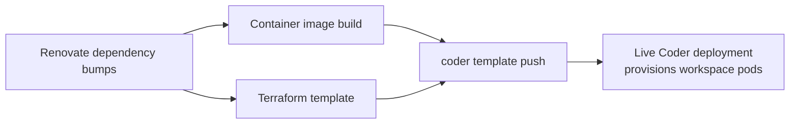
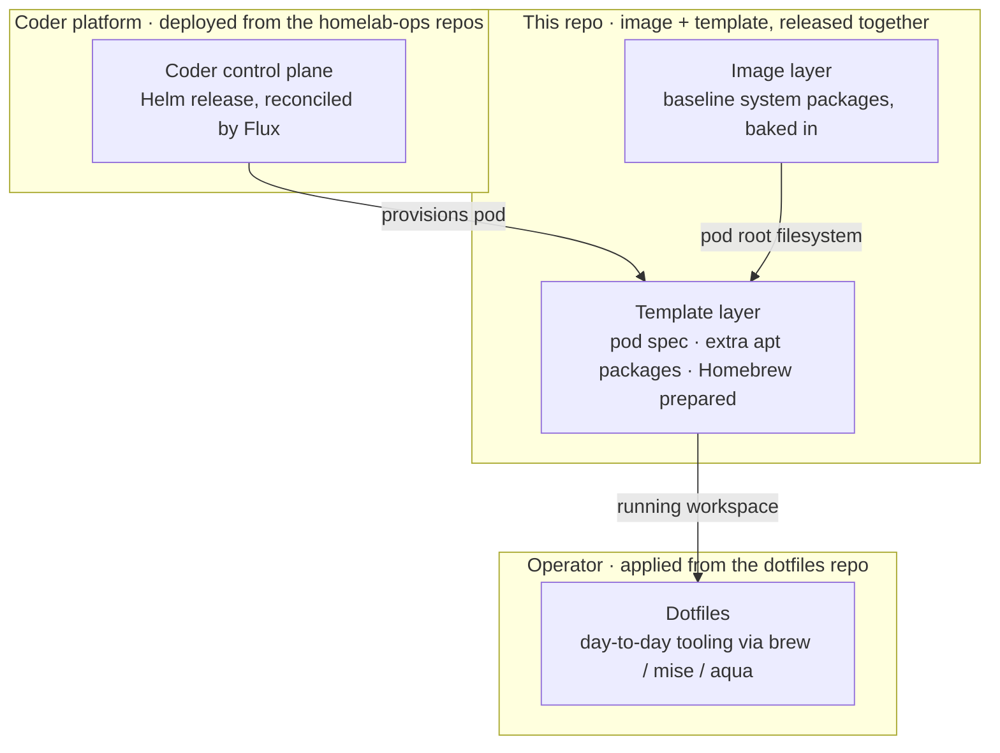

# DESIGN.md

Why this repo is shaped the way it is, and how its pieces tie together as one system. For what each piece is and where it lives, see [README.md](README.md). For commands and implementation gotchas, see [CLAUDE.md](CLAUDE.md).

## Intent

One operator, one homelab Kubernetes cluster, one Coder deployment. This is not a multi-tenant or general-purpose template — it's optimized for a single person keeping their own dev environments current with minimal ongoing effort, not for flexibility across teams or clusters.

## How the pieces tie together

```mermaid
flowchart LR
    Renovate[Renovate dependency bumps] --> Image
    Renovate --> Template

    Image[Container image build] --> Push[coder template push]
    Template[Terraform template] --> Push
    Push --> Live[Live Coder deployment<br/>provisions workspace pods]
```

The image and template are two halves of one release, not independent artifacts: a release build produces an image tag, and the *same* pipeline run pushes the template pointing at that exact tag. There's no version matrix of "which template versions work with which image versions" to reason about — the pipeline guarantees there's only ever one pairing in play. The cost is coupling: an image-only fix still needs a template push (and vice versa) to ship.

The "live Coder deployment" this pushes to is itself provisioned separately, and what an operator actually works in is assembled from more layers than these two — see [Where the workspace environment comes from](#where-the-workspace-environment-comes-from) below.

Renovate feeds both halves continuously (Terraform provider versions, image package/tool versions, GitHub Actions), so the day-to-day work in this repo is mostly reviewing and merging those bumps rather than writing new template/image logic.

## Where the workspace environment comes from

The environment an operator ends up working in isn't defined in one place — it's assembled in layers, and this repo owns only the middle two. Each layer downward is more shared, more reproducible, and changed less often; each layer upward is more personal and more self-service.

```mermaid
flowchart TB
    subgraph platform [Coder platform · deployed from the homelab-ops repos]
      Coder[Coder control plane<br/>Helm release, reconciled by Flux]
    end
    subgraph here [This repo · image + template, released together]
      Image[Image layer<br/>baseline system packages, baked in]
      Template[Template layer<br/>pod spec · extra apt packages · Homebrew prepared]
    end
    subgraph operator [Operator · applied from the dotfiles repo]
      Dotfiles[Dotfiles<br/>day-to-day tooling via brew / mise / aqua]
    end

    Coder -->|provisions pod| Template
    Image -->|pod root filesystem| Template
    Template -->|running workspace| Dotfiles
```

- **Coder platform** — the control plane that runs these templates is itself deployed to the cluster elsewhere: the Helm release in [`homelab-ops-kubernetes-apps`](../homelab-ops-kubernetes-apps/apps/subsystems/coder/helm-release-coder.yaml) and the Flux Kustomization that wires it into the homelab cluster in [`homelab-ops-kubernetes-clusters`](../homelab-ops-kubernetes-clusters/clusters/homelab/kustomizations/apps-coder.yaml). This repo produces what runs *on* that platform, not the platform itself.
- **Image** ([`Dockerfile`](images/homelab-workspace/Dockerfile)) — the baseline every workspace needs and nothing more. Baked in so startup is fast and the result reproducible; the cost of a rebuild-and-release is only worth paying for things wanted everywhere.
- **Template** ([`deployment.tf`](templates/kubernetes/homelab-workspace/deployment.tf), [`script-prepare-workspace.sh`](templates/kubernetes/homelab-workspace/script-prepare-workspace.sh)) — builds the pod and closes the gap between the baseline image and a usable workspace: a small set of extra apt packages (build toolchains and the like — left out of the image because they're large and only occasionally needed, yet only sensibly obtained as apt packages) and Homebrew installed and prepared so the layer above has something to build on.
- **Dotfiles** ([`dotfiles`](../dotfiles)) — at provision time the operator's dotfiles configure the shell/environment and install the actual day-to-day tooling via Homebrew, mise, and aqua. This is per-operator and changes constantly, so it lives with the operator rather than in the template.

The rule that ties the layers together: a package or tool belongs in the *lowest* layer that still makes sense for it. Universal and stable → image. Occasionally-needed, apt-only, and too heavy to bake in → the template's `system_packages` parameter. Personal, fast-moving, or not an apt package → dotfiles. This is what keeps the image small and reproducible while still letting one-off needs be self-served — the same trade examined from the package angle in [Reproducible image vs. self-service packages](#design-tensions-and-decisions) below.

## Design tensions and decisions

**Reproducible image vs. self-service packages.** A workspace user can request extra system packages via a template parameter rather than needing an image rebuild reviewed and released. That means the workspace's installed-package set isn't fully determined by the image alone — a deliberate trade of strict reproducibility for letting one-off tooling needs be self-served instead of turning into an image-change request every time.

**Shared persistence, not per-workspace isolation.** All workspaces provisioned from this template persist their home directory (and installed tools like Homebrew) onto one shared volume, isolated from each other only logically rather than through separate storage. For a single-operator homelab, this is simpler to provision and reason about than storage-per-workspace, at the cost of weaker isolation between workspaces than a multi-tenant design would want.

**No staging environment, so the release pipeline carries its own rehearsal path.** There's exactly one live template and one live cluster — no separate staging Coder deployment to try changes against first. Rather than accept "every merge to main is a live-fire test," the release pipeline itself can run in a mode that exercises a real build and a real (but disposable, clearly-named) template push without touching the production template or its persistent state. That path is what makes it safe to iterate on template/image changes at the same pace as everything else in the repo. See [TESTING.md](TESTING.md) for how to use it.

**Unprivileged by default.** The workspace itself runs as an unprivileged, non-root, fixed-identity container. Anything that genuinely needs elevated privilege (installing packages, preparing shared volume state) is scoped to a narrow, short-lived setup step that runs before the workspace shell exists, not to something the workspace user can reach into.

**The Deployment name is a Prometheus identity, not just a Kubernetes identifier.** `deployment.tf` names the workspace Deployment `coder-workspace-<owner>-<workspace-name>` (`local.workload_name` in `main.tf`) rather than the workspace UUID it used before. cAdvisor's `container_*` series carry no Kubernetes labels — they come from the cgroup filesystem, with no API-server connection — so per-workspace CPU/memory/PSI/OOM can only be attributed to a human-readable identity through the cluster's existing `namespace_workload_pod:kube_pod_owner:relabel` recording rule, which resolves pod → ReplicaSet → Deployment into a `workload` label. That rule already runs for free; naming the Deployment meaningfully is the only lever this repo has to make its output meaningful, at zero added Prometheus series and no PromQL join. Three things shape the exact scheme:

- *Owner is included* even though this is a single-operator homelab today, because Coder workspace names are unique per-owner, not cluster-wide — two owners could otherwise pick the same workspace name and collide. Cheap to include now; expensive to retrofit after a second migration.
- *The prefix is `coder-workspace-`, not just `coder-`*, matching the `app.kubernetes.io/part-of` value already used in `main.tf`'s `common_labels`. A bare `coder-` prefix isn't enough to unambiguously mean "workspace": the same Kubernetes namespace also holds the `coder` control-plane Deployment itself and other `coder`-prefixed infra (e.g. a CloudNativePG cluster named `coder-db-<date>`) that a naive `workload=~"coder-.+"` match would also catch.
- *Renaming a workspace already relocates its home directory* (the `home` volume's `sub_path` is `data.coder_workspace.me.name`), so coupling the Deployment name to the workspace name too doesn't introduce a new class of rename hazard — it's already priced in. A rename recreates the Deployment (the pod restarts anyway) and needs a fresh `coder-workspace-<owner>-<new-name>` home subdirectory, exactly as it needed a fresh `sub_path` before this change.

**A userspace memory watchdog, because the kernel's own mechanisms are out of reach.** The workspace pod has a hard memory limit, and a memory-hungry editor server can walk it into a cgroup OOM. The kill itself would be tolerable; its blast radius is not. `memory.oom.group` is set to `1` by the kubelet, so a cgroup OOM kills *every process in the container as a group* — the IDE, every tmux session, and every long-running agent, together. That also rules out the usual mitigation: with `oom.group = 1`, nudging `oom_score_adj` cannot make one process die instead of all of them, because there is no victim selection left to influence.

The two obvious fixes are both unreachable from inside this container. Throttling with `memory.high`, or confining the editor to a child cgroup, would need a writable `/sys/fs/cgroup` — but it is mounted read-only, `cgroup.subtree_control` is empty, the cgroup namespace is private, and the workspace user has no capabilities. Getting either would mean `privileged: true` or a read-write host mount of `/sys/fs/cgroup`, which is exactly what *Unprivileged by default* above exists to prevent. Raising the limit was also considered and rejected: it moves the wall rather than removing it, and the pod is already large for a single-operator homelab.

What is left is to never reach the limit in the first place, which is what [`script-memory-watchdog.sh`](templates/kubernetes/homelab-workspace/script-memory-watchdog.sh) does. It samples how much genuinely unreclaimable memory the cgroup holds, and — as the editor's helper processes grow — lowers their *soft* `RLIMIT_DATA` so that one of them fails its own allocation and restarts, instead of the kernel taking down the whole container. Lowering another same-uid process's soft limit needs no privilege, and leaving the hard limit alone means any shell that inherits the ceiling can lift it again.

Which processes it may touch is settled by executable path, not by name or role heuristics: only a process whose own binary lives under `~/.vscode-server` counts as the editor's. That boundary is doing more work than it appears to. A provisioned workspace carries two unrelated node installations — VS Code's bundled one, which arrives with the server download, and the operator's from mise, which is what repo tooling and long-running agent sessions run on — and a rule that asked "is this node" instead of "whose binary is this" would classify an agent session spawned by an extension as an editor helper and shed it. The watchdog exists to stop the operator's work being collateral damage, so a detection rule that makes it the target would be a self-defeating one. Terminal descendants are excluded on top of that, by excising the editor's pty host and everything beneath it.

The trade is that this is a userspace daemon in a pod with no supervisor, doing something the kernel would do better if it were allowed to. It is therefore built to be deletable in one step if the constraint ever lifts, and it defaults to an observe-only mode — measuring and logging, changing nothing — so that the thresholds at which it acts get set from a week of this workload's own data rather than from a guess. That default is a workspace parameter rather than a constant, because the thresholds are absolute byte counts sized for the larger pod, and the same setting that suits it sits permanently near the first tier on a smaller one. Its measurement deliberately disagrees with every stock memory reading, including Coder's own: page cache and reclaimable slab make this pod look near death while it is idle, and a watchdog that believed them would fire constantly. That disagreement is the point of the thing, so the honest number is surfaced next to the misleading one in the workspace UI rather than replacing it.

## Outcomes targeted

- One operator can keep dependencies current and ship template/image changes at low ongoing effort, without a fleet of environments to maintain.
- Changes can be exercised for real before they affect the template already in use — safe iteration without a staging cluster.
- Workspace users get self-service customization without being able to affect anything beyond their own workspace's package set and environment.
